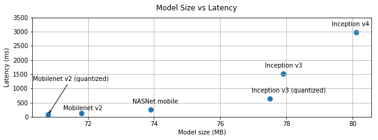

# Performance best practices

Mobile and embedded devices have limited computational resources and it is important to keep your application resource efficient. We have compiled a list of best practices and strategies you can use to optimize your model and application when using Tensorflow Lite.

## Choose the best model for the task
Depending on the task you will need to make a tradeoff between model complexity and size. If your task requires high accuracy then you may need a large and complex model. Some tasks may work with a less precise model, for these tasks it is better to use a smaller but less precise model. Smaller models not only use less disk space and memory but are generally faster and more energy efficient. For example, graphs below show accuracy and latency tradeoff for some common image classification models.

One example of models optimized for mobile devices are [MobileNets](https://arxiv.org/abs/1704.04861), which are optimized for mobile vision applications. Tensorflow Lite [models page](models.md) lists several other models that have been optimized specifically for mobile and embedded devices.

You can retrain the listed models on your own dataset by using transfer learning. Check out our transfer learning tutorial for
[image classification](https://codelabs.developers.google.com/codelabs/tensorflow-for-poets/#0) and
 [object detection](https://medium.com/tensorflow/training-and-serving-a-realtime-mobile-object-detector-in-30-minutes-with-cloud-tpus-b78971cf1193).

## Profile your model
Once you have selected a candidate model that is right for your task, it is a good practice to profile and benchmark your model. Tensorflow Lite [benchmarking tool](https://github.com/tensorflow/tensorflow/tree/master/tensorflow/contrib/lite/tools/benchmark) has a built-in profiler that shows per operator profiling statistics. This can help in understanding performance bottlenecks and which operators dominate the computation time.

## Profile and optimize operators in the graph
If a particular operator appears frequently in the model and based on profiling you find the operator consuming the most amount of time, you can look into optimizing the operator.
 This scenario should be rare as Tensorflow Lite has optimized versions for most ops. However you may be able to write a faster version of a custom op, if you know the constraints in which the operator is executed. Check out our [custom operator documentation](custom_operators.md).

## Quantize your model
If your model uses floating point weights or activations then it may be possible to reduce the size of model up to ~4x by using quantization and other model optimizations. Check out our [model optimization toolkit](https://www.tensorflow.org/performance/model_optimization) for details about optimizing your model. 

## Tweak the number of threads
Tensorflow Lite supports multi-threaded kernels for many operators. You can increase the number of threads and speed up execution of operators. Increasing the number of threads will however make your model use more resources and power. For some applications latency may be more important than energy efficiency. You can increase the number of threads by setting the number of [interpreter](https://github.com/tensorflow/tensorflow/blob/1084594657a5d139102ac794f84d1427a710e39a/tensorflow/contrib/lite/interpreter.h#L337) threads. Multi-threaded execution however comes at the cost of increased performance variability depending on what else is been executed concurrently. This is particularly the case for mobile apps. For example, isolated tests may show 2x speed up vs single-threaded but if another app is executing at the same time may result in worst performance than single-threaded.

## Eliminate redundant copies
If your application is not careful, there can be redundant copies when feeding the input to the model and reading output from the model. Make sure to eliminate redundant copies. If you are using higher level APIs like Java API, make sure to carefully check the documentation for performance caveats. For example, the Java API is a lot faster if ByteBuffers are used as [inputs](https://github.com/tensorflow/tensorflow/blob/6305a6d83552ba6a472cd72398b60d9241467f1f/tensorflow/contrib/lite/java/src/main/java/org/tensorflow/lite/Interpreter.java#L151).

## Profile your application with platform specific tools
Platform specific tools like [Android profiler](https://developer.android.com/studio/profile/android-profiler) and [Instruments](https://help.apple.com/instruments/mac/current/) provide a wealth of profiling information that can be used to debug your app. Sometimes the performance bug may be not in the model but in parts of application code that interact with the model. Make sure to familiarize yourself with platform specific profiling tools and best practices for your platform.

## Evaluate whether your model benefits from using hardware accelerators available on the device
Tensorflow Lite is working on adding support for accelerators like GPU and provides acceleration through [Neural Networks API](https://developer.android.com/ndk/guides/neuralnetworks/) on Android.
You can utilize these hardware accelerator backends to improve the speed and efficiency of your model. To enable Neural Networks API call [UseNNAPI](https://github.com/tensorflow/tensorflow/blob/6305a6d83552ba6a472cd72398b60d9241467f1f/tensorflow/contrib/lite/interpreter.h#L334) on the interpreter instance.

## Need more help
The Tensorflow team is happy to help diagnose and address specific performance issues you may be facing. Please file a bug on [github](https://github.com/tensorflow/tensorflow/issues) with details of the issue.
