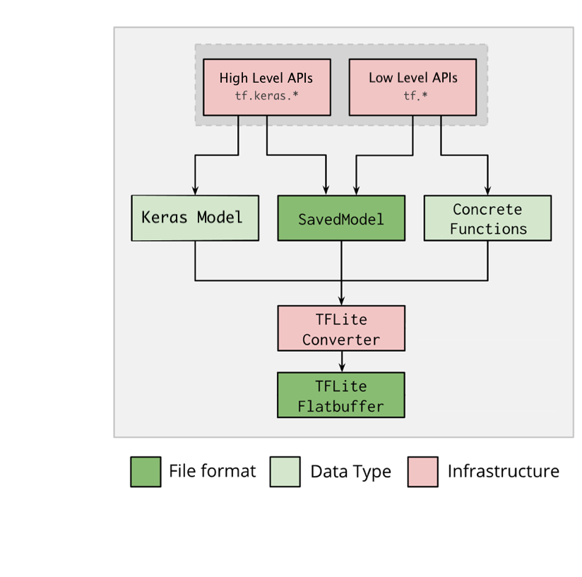

# TensorFlow Lite converter

The TensorFlow Lite converter takes a TensorFlow model and generates a
TensorFlow Lite model (an optimized
[FlatBuffer](https://google.github.io/flatbuffers/) format identified by the
`.tflite` file extension). You have the following two options for using the
converter:

1.  [Python API](#python_api) (***recommended***): This makes it easier to
    convert models as part of the model development pipeline, apply
    optimizations, add metadata and has many more features.
2.  [Command line](#cmdline): This only supports basic model conversion.

Note: In case you encounter any issues during model conversion, create a
[GitHub issue](https://github.com/tensorflow/tensorflow/issues/new?template=60-tflite-converter-issue.md).



## Python API <a name="python_api"></a>

*Helper code: To identify the installed TensorFlow version, run
`print(tf.__version__)` and to learn more about the TensorFlow Lite converter
API, run `print(help(tf.lite.TFLiteConverter))`.*

If you've
[installed TensorFlow 2.x](https://www.tensorflow.org/install/pip#tensorflow-2-packages-are-available),
you have the following two options: (*if you've
[installed TensorFlow 1.x](https://www.tensorflow.org/install/pip#older-versions-of-tensorflow),
refer to
[Github](https://github.com/tensorflow/tensorflow/blob/master/tensorflow/lite/g3doc/r1/convert/python_api.md)*)

*   Convert a TensorFlow 2.x model using
    [`tf.lite.TFLiteConverter`](https://www.tensorflow.org/api_docs/python/tf/lite/TFLiteConverter).
    A TensorFlow 2.x model is stored using the SavedModel format and is
    generated either using the high-level `tf.keras.*` APIs (a Keras model) or
    the low-level `tf.*` APIs (from which you generate concrete functions). As a
    result, you have the following three options (examples are in the next few
    sections):

    *   `tf.lite.TFLiteConverter.from_saved_model()` (**recommended**): Converts
        a [SavedModel](https://www.tensorflow.org/guide/saved_model).
    *   `tf.lite.TFLiteConverter.from_keras_model()`: Converts a
        [Keras](https://www.tensorflow.org/guide/keras/overview) model.
    *   `tf.lite.TFLiteConverter.from_concrete_functions()`: Converts
        [concrete functions](https://www.tensorflow.org/guide/intro_to_graphs).

*   Convert a TensorFlow 1.x model using
    [`tf.compat.v1.lite.TFLiteConverter`](https://www.tensorflow.org/api_docs/python/tf/compat/v1/lite/TFLiteConverter)
    (examples are on
    [Github](https://github.com/tensorflow/tensorflow/blob/master/tensorflow/lite/g3doc/r1/convert/python_api.md)):

    *   `tf.compat.v1.lite.TFLiteConverter.from_saved_model()`: Converts a
        [SavedModel](https://www.tensorflow.org/guide/saved_model).
    *   `tf.compat.v1.lite.TFLiteConverter.from_keras_model_file()`: Converts a
        [Keras](https://www.tensorflow.org/guide/keras/overview) model.
    *   `tf.compat.v1.lite.TFLiteConverter.from_session()`: Converts a GraphDef
        from a session.
    *   `tf.compat.v1.lite.TFLiteConverter.from_frozen_graph()`: Converts a
        Frozen GraphDef from a file. If you have checkpoints, then first convert
        it to a Frozen GraphDef file and then use this API as shown
        [here](https://github.com/tensorflow/tensorflow/blob/master/tensorflow/lite/g3doc/r1/convert/python_api.md#checkpoints).

Note: The following sections assume you've both installed TensorFlow 2.x and
trained models in TensorFlow 2.x.

### Convert a SavedModel (recommended) <a name="saved_model"></a>

The following example shows how to convert a
[SavedModel](https://www.tensorflow.org/guide/saved_model) into a TensorFlow
Lite model.

```python
import tensorflow as tf

# Convert the model
converter = tf.lite.TFLiteConverter.from_saved_model(saved_model_dir) # path to the SavedModel directory
tflite_model = converter.convert().

# Save the model.
with open('model.tflite', 'wb') as f:
  f.write(tflite_model)
```

### Convert a Keras model <a name="keras"></a>

The following example shows how to convert a
[Keras](https://www.tensorflow.org/guide/keras/overview) model into a TensorFlow
Lite model.

```python
import tensorflow as tf

# Create a model using high-level tf.keras.* APIs
model = tf.keras.models.Sequential([
    tf.keras.layers.Dense(units=1, input_shape=[1])
    tf.keras.layers.Dense(units=16, activation='relu'),
    tf.keras.layers.Dense(units=1)
])
model.compile(optimizer='sgd', loss='mean_squared_error') # compile the model
model.fit(x=[-1, 0, 1], y=[-3, -1, 1], epochs=5) # train the model
# (to generate a SavedModel) tf.saved_model.save(model, "saved_model_keras_dir")

# Convert the model.
converter = tf.lite.TFLiteConverter.from_keras_model(model)
tflite_model = converter.convert()

# Save the model.
with open('model.tflite', 'wb') as f:
  f.write(tflite_model)
```

### Convert concrete functions <a name="concrete_function"></a>

The following example shows how to convert
[concrete functions](https://www.tensorflow.org/guide/intro_to_graphs) into a
TensorFlow Lite model.

Note: Currently, it only supports the conversion of a single concrete function.

```python
import tensorflow as tf

# Create a model using low-level tf.* APIs
class Squared(tf.Module):
  @tf.function
  def __call__(self, x):
    return tf.square(x)
model = Squared()
# (ro run your model) result = Squared(5.0) # This prints "25.0"
# (to generate a SavedModel) tf.saved_model.save(model, "saved_model_tf_dir")
concrete_func = model.__call__.get_concrete_function()

# Convert the model
converter = tf.lite.TFLiteConverter.from_concrete_functions([concrete_func])
tflite_model = converter.convert()

# Save the model.
with open('model.tflite', 'wb') as f:
  f.write(tflite_model)
```

### Other features

*   Apply [optimizations](../performance/model_optimization.md). A common
    optimization used is
    [post training quantization](../performance/post_training_quantization.md),
    which can further reduce your model latency and size with minimal loss in
    accuracy.

*   Handle unsupported operations. You have the following options if your model
    has operators:

    1.  Supported in TensorFlow but unsupported in TensorFlow Lite: If you have
        size constraints, you need to
        [create the TensorFlow Lite operator](../guide/ops_custom.md), otherwise
        just [use TensorFlow operators](../guide/ops_select.md) in your
        TensorFlow Lite model.

    2.  Unsupported in TensorFlow: You need to
        [create the TensorFlow operator](https://www.tensorflow.org/guide/create_op)
        and then [create the TensorFlow Lite operator](../guide/ops_custom.md).
        If you were unsuccessful at creating the TensorFlow operator or don't
        wish to create one (**not recommended, proceed with caution**), you can
        still convert using the `custom_opdefs` attribute and then directly
        [create the TensorFlow Lite operator](../guide/ops_custom.md). The
        `custom_opdefs` attribute is a string containing an (or a list of)
        [OpDef](https://github.com/tensorflow/tensorflow/blob/master/tensorflow/core/framework/op_def.proto)
        (s) or operator definition proto(s). Below is an example of a
        `TFLiteAwesomeCustomOp` with 1 input, 1 output, and 2 attributes:

        ```python
          converter.custom_opdefs="""name: 'TFLiteAwesomeCustomOp' input_arg:
          { name: 'In' type: DT_FLOAT } output_arg: { name: 'Out' type: DT_FLOAT }
          attr : { name: 'a1' type: 'float'} attr : { name: 'a2' type: 'list(float)'}"""
        ```

## Command Line Tool <a name="cmdline"></a>

**It is highly recommended that you use the [Python API](#python_api) listed
above instead, if possible.**

If you've
[installed TensorFlow 2.x from pip](https://www.tensorflow.org/install/pip), use
the `tflite_convert` command as follows: (*if you've
[installed TensorFlow 2.x from source](https://www.tensorflow.org/install/source)
then you can replace '`tflite_convert`' with '`bazel run
//tensorflow/lite/python:tflite_convert --`' in the following
sections, and if you've
[installed TensorFlow 1.x](https://www.tensorflow.org/install/pip#older-versions-of-tensorflow)
then refer to Github
([reference](https://github.com/tensorflow/tensorflow/blob/master/tensorflow/lite/g3doc/r1/convert/cmdline_reference.md),
[examples](https://github.com/tensorflow/tensorflow/blob/master/tensorflow/lite/g3doc/r1/convert/cmdline_examples.md)))*

`tflite_convert`: To view all the available flags, use the following command:

```sh
$ tflite_convert --help

`--output_file`. Type: string. Full path of the output file.
`--saved_model_dir`. Type: string. Full path to the SavedModel directory.
`--keras_model_file`. Type: string. Full path to the Keras H5 model file.
`--enable_v1_converter`. Type: bool. (default False) Enables the converter and flags used in TF 1.x instead of TF 2.x.

You are required to provide the `--output_file` flag and either the `--saved_model_dir` or `--keras_model_file` flag.
```

### Converting a SavedModel <a name="cmdline_saved_model"></a>

```sh
tflite_convert \
  --saved_model_dir=/tmp/mobilenet_saved_model \
  --output_file=/tmp/mobilenet.tflite
```

### Converting a Keras H5 model <a name="cmdline_keras_model"></a>

```sh
tflite_convert \
  --keras_model_file=/tmp/mobilenet_keras_model.h5 \
  --output_file=/tmp/mobilenet.tflite
```

## Next Steps

*   Add [metadata](metadata.md), which makes it easier to create platform
    specific wrapper code when deploying models on devices.
*   Use the [TensorFlow Lite interpreter](../guide/inference.md) to run
    inference on a client device (e.g. mobile, embedded).
