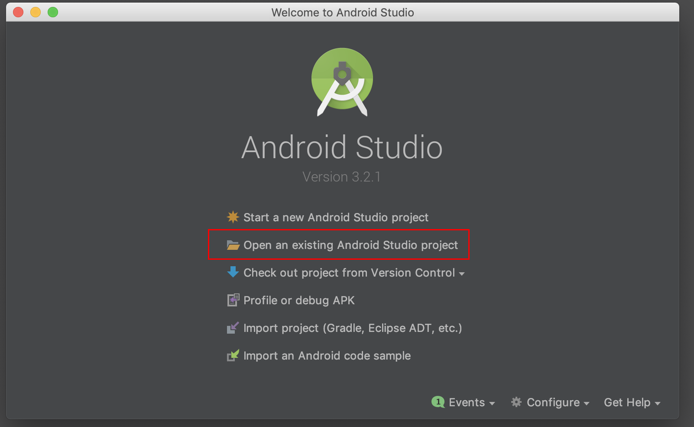
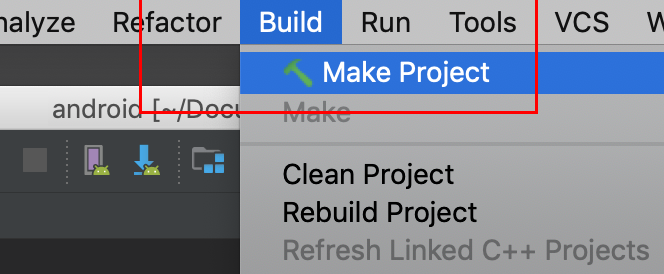
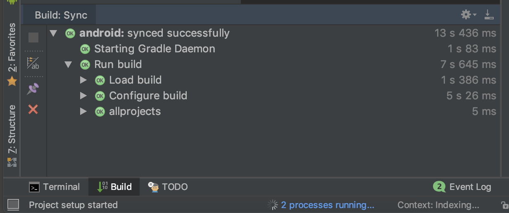
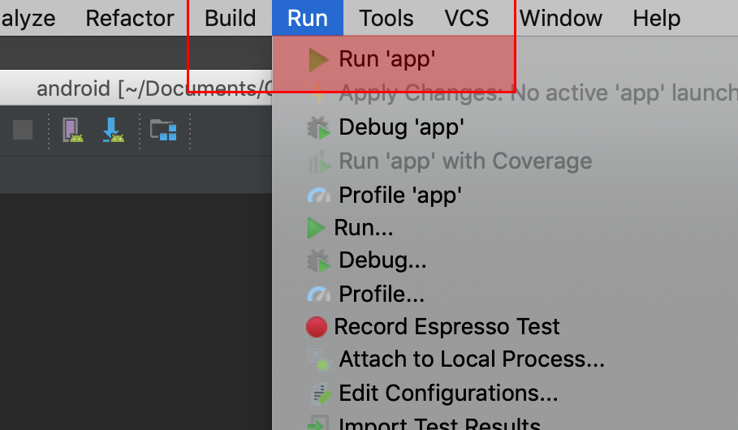
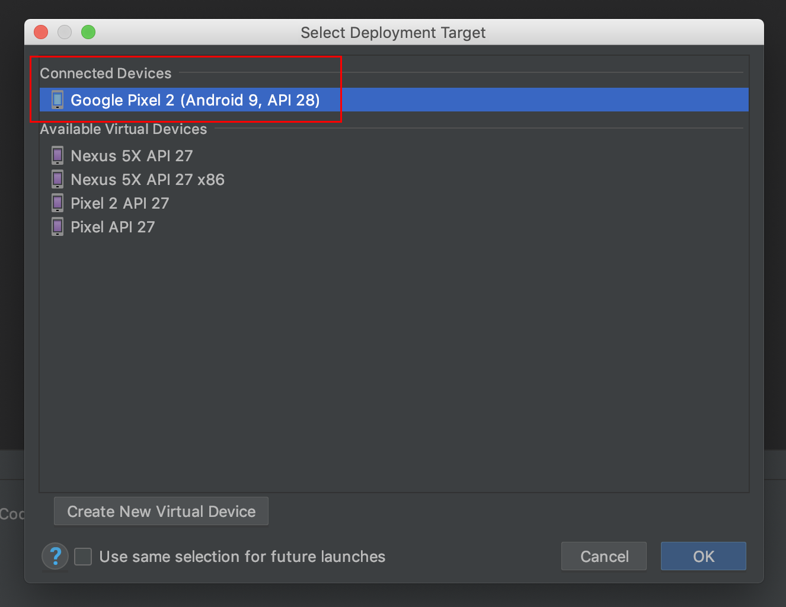

# TensorFlow Lite Android Image Classifier App Example

This tutorial provides a simple Android mobile application to classify images
using the Android device camera. In this tutorial, you will download the demo
application from the Tensorflow repository, build it on your computer, and
install it on your Android Device. You will also learn how to customize the
application to suit your requirements.

### Prerequisites

*   Android Studio 3.2 (installed on a Linux, Mac or Windows machine)

*   Android Device

*   USB cable (to connect Android device to your computer)

### Step 1. Clone the TensorFlow source code

First, we clone the GitHub repository on the computer in a folder to get the
demo application.

```

git clone https://github.com/tensorflow/tensorflow

```

Open the TensorFlow source code in Android Studio. To do this, open Android
Studio and select `Open an existing project` setting the folder to
`tensorflow/lite/examples/android`



This folder contains the demo application for image classification, object
detection, and speech hotword detection.

### Step 2. Build the Android Studio project

In this step, Select `Build -> Make Project` and check that the project builds
successfully. You will need Android SDK configured in the settings. You'll need
at least SDK version 23. The gradle file will prompt you to download any missing
libraries.





#### TensorFlow Lite AAR from JCenter:

Note that the `build.gradle` is configured to use TensorFlow Lite's nightly
build.

If you see a build error related to compatibility with Tensorflow Lite's Java
API (example: method X is undefined for type Interpreter), there has likely been
a backwards compatible change to the API. You will need to pull new app code
that's compatible with the nightly build by running git pull.

### Step 3. Install and Run the app

Connect the Android device to the computer, and be sure to approve any ADB
permission prompts that appear on your phone. Select `Run -> Run app.` Select
the deployment target in the connected devices to the device on which app will
be installed. This will install the app on the device.






To test the app, open the app named `TFL Classify` on the device. When you run
the app first time, the app will request permission to access the camera.
Re-installing the app may require you to uninstall the previous installations.

## Understanding Android App Code

### Get camera input

This mobile application gets the camera input using the functions defined in the
file CameraActivity.java in the folder
`tensorflow/tensorflow/lite/examples/android/app/src/main/java/org/tensorflow/demo/CameraActivity.java.`
This file depends on `AndroidManifest.xml` in the folder
`tensorflow/tensorflow/lite/examples/android/app/src/main` to set the camera
orientation.

### Pre-process of bitmap image

The mobile application code that pre-processes the images and runs inference is
in
`tensorflow/tensorflow/lite/examples/android/app/src/main/java/org/tensorflow/demo/TFLiteImageClassifier.java.`
Here, we take the input camera bitmap image and convert it to a Bytebuffer
format for efficient processing. We pre-allocate the memory for ByteBuffer
object based on the image dimensions because Bytebuffer objects can't infer the
object shape.

```
c.imgData =
ByteBuffer.allocateDirect( DIM_BATCH_SIZE * DIM_IMG_SIZE_X * DIM_IMG_SIZE_Y *
DIM_PIXEL_SIZE);
c.imgData.order(ByteOrder.nativeOrder());
```

While running the application, we preprocess the incoming bitmap images from the
camera to a Bytebuffer. Since this model is quantized 8-bit, we will put a
single byte for each channel. `imgData` will contain an encoded `Color` for each
pixel in ARGB format, so we need to mask the least significant 8 bits to get
blue, and next 8 bits to get green and next 8 bits to get blue, and we have an
opaque image so alpha can be ignored.

```
 imgData.rewind();
 bitmap.getPixels(intValues, 0, bitmap.getWidth(), 0, 0, bitmap.getWidth(), bitmap.getHeight());
 // Convert the image to floating point.
 int pixel = 0;
 for (int i = 0; i < DIM_IMG_SIZE_X; ++i) {
   for (int j = 0; j < DIM_IMG_SIZE_Y; ++j) {
     final int val = intValues[pixel++];
     imgData.put((byte) ((val >> 16) & 0xFF));
     imgData.put((byte) ((val >> 8) & 0xFF));
     imgData.put((byte) (val & 0xFF));
     }
  }
```

### Create interpreter

To create the interpreter, we need to load the model file. In Android devices,
we recommend pre-loading and memory mapping the model file as shown below to
offer faster load times and reduce the dirty pages in memory. If your model file
is compressed, then you will have to load the model as a `File`, as it cannot be
directly mapped and used from memory.

```
// Memory-map the model file
AssetFileDescriptor fileDescriptor = assets.openFd(modelFilename);
FileInputStream inputStream = new
FileInputStream(fileDescriptor.getFileDescriptor()); FileChannel fileChannel =
inputStream.getChannel(); long startOffset = fileDescriptor.getStartOffset();
long declaredLength = fileDescriptor.getDeclaredLength(); return
fileChannel.map(FileChannel.MapMode.READ_ONLY, startOffset, declaredLength);
```

Then, create the interpreter object using `new Interpreter()` that takes the
model file as argument as shown below.

```
// Create Interpreter
c.tfLite = new Interpreter(loadModelFile(assetManager, modelFilename));
```

### Run inference

The output of the inference is stored in a byte array `labelprob.` We
pre-allocate the memory for the output buffer. Then, we run inference on the
interpreter object using function `run()` that takes input and output buffers as
arguments.

```
// Pre-allocate output buffers.
c.labelProb = new byte[1][c.labels.size()];
// Run Inference
tfLite.run(imgData, labelProb);
```

### Post-process values

Finally, we find the best set of classifications by storing them in a priority
queue based on their confidence scores.

```
// Find the best classifications
PriorityQueue<Recognition> pq = ...
for (int i = 0; i < labels.size(); ++i)
{
  pq.add( new Recognition( ' '+ i,
  labels.size() > i ? labels.get(i) : unknown,
  (float) labelProb[0][i], null));
}
```

And we display up to MAX_RESULTS number of classifications in the application,
where Recognition is a generic class defined in `Classifier.java` that contains
the following information of the classified object: id, title, label, and its
location when the model is an object detection model.

```
// Display the best classifications
final ArrayList<Recognition> recognitions =
  new ArrayList<Recognition>();
int recognitionsSize = Math.min(pq.size(), MAX_RESULTS);
for (int i = 0; i < recognitionsSize; ++i) {
  recognitions.add(pq.poll());
}
```

### Load onto display

We render the results on the Android device screen using the following lines in
`processImage()` function in `ClassifierActivity.java` which uses the UI defined
in `RecognitionScoreView.java.`

```
resultsView.setResults(results);
requestRender();
```
