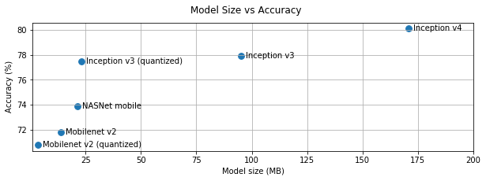
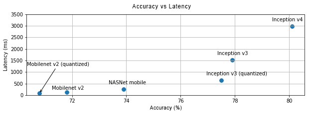

# Performance best practices

Mobile and embedded devices have limited computational resources, so it is
important to keep your application resource efficient. We have compiled a list
of best practices and strategies that you can use to improve your TensorFlow
Lite model performance.

## Choose the best model for the task

Depending on the task, you will need to make a tradeoff between model complexity
and size. If your task requires high accuracy, then you may need a large and
complex model. For tasks that require less precision, it is better to use a
smaller model because they not only use less disk space and memory, but they are
also generally faster and more energy efficient. For example, graphs below show
accuracy and latency tradeoffs for some common image classification models.

One example of models optimized for mobile devices are
[MobileNets](https://arxiv.org/abs/1704.04861), which are optimized for mobile
vision applications. [Hosted models](../models/hosted.md) lists several other
models that have been optimized specifically for mobile and embedded devices.

You can retrain the listed models on your own dataset by using transfer
learning. Check out our transfer learning tutorial for
[image classification](https://colab.sandbox.google.com/github/tensorflow/examples/blob/master/tensorflow_examples/lite/model_maker/demo/image_classification.ipynb)
and
[object detection](https://medium.com/tensorflow/training-and-serving-a-realtime-mobile-object-detector-in-30-minutes-with-cloud-tpus-b78971cf1193).

## Profile your model

Once you have selected a candidate model that is right for your task, it is a
good practice to profile and benchmark your model. TensorFlow Lite
[benchmarking tool](https://github.com/tensorflow/tensorflow/tree/master/tensorflow/lite/tools/benchmark)
has a built-in profiler that shows per operator profiling statistics. This can
help in understanding performance bottlenecks and which operators dominate the
computation time.

## Profile and optimize operators in the graph

If a particular operator appears frequently in the model and, based on
profiling, you find that the operator consumes the most amount of time, you can
look into optimizing that operator. This scenario should be rare as TensorFlow
Lite has optimized versions for most operators. However, you may be able to
write a faster version of a custom op if you know the constraints in which the
operator is executed. Check out our
[custom operator documentation](../custom_operators.md).

## Optimize your model

Model optimization aims to create smaller models that are generally faster and
more energy efficient, so that they can be deployed on mobile devices. There are
multiple optimization techniques supported by TensorFlow Lite, such as
quantization.

Check out our [model optimization docs](model_optimization.md) for details.

## Tweak the number of threads

TensorFlow Lite supports multi-threaded kernels for many operators. You can
increase the number of threads and speed up execution of operators. Increasing
the number of threads will, however, make your model use more resources and
power.

For some applications, latency may be more important than energy efficiency. You
can increase the number of threads by setting the number of interpreter
[threads](https://github.com/tensorflow/tensorflow/blob/master/tensorflow/lite/interpreter.h#L346).
Multi-threaded execution, however, comes at the cost of increased performance
variability depending on what else is executed concurrently. This is
particularly the case for mobile apps. For example, isolated tests may show 2x
speed-up vs single-threaded, but, if another app is executing at the same time,
it may result in worse performance than single-threaded.

## Eliminate redundant copies

If your application is not carefully designed, there can be redundant copies
when feeding the input to and reading the output from the model. Make sure to
eliminate redundant copies. If you are using higher level APIs, like Java, make
sure to carefully check the documentation for performance caveats. For example,
the Java API is a lot faster if ByteBuffers are used as
[inputs](https://github.com/tensorflow/tensorflow/blob/master/tensorflow/lite/java/src/main/java/org/tensorflow/lite/Interpreter.java#L175).

## Profile your application with platform specific tools

Platform specific tools like
[Android profiler](https://developer.android.com/studio/profile/android-profiler)
and [Instruments](https://help.apple.com/instruments/mac/current/) provide a
wealth of profiling information that can be used to debug your app. Sometimes
the performance bug may be not in the model but in parts of application code
that interact with the model. Make sure to familiarize yourself with platform
specific profiling tools and best practices for your platform.

## Evaluate whether your model benefits from using hardware accelerators available on the device

TensorFlow Lite has added new ways to accelerate models with faster hardware
like GPUs, DSPs, and neural accelerators. Typically, these accelerators are
exposed through [delegate](delegates.md) submodules that take over parts of the
interpreter execution. TensorFlow Lite can use delegates by:

*   Using Android's
    [Neural Networks API](https://developer.android.com/ndk/guides/neuralnetworks/).
    You can utilize these hardware accelerator backends to improve the speed and
    efficiency of your model. To enable the Neural Networks API, call
    [UseNNAPI](https://github.com/tensorflow/tensorflow/blob/master/tensorflow/lite/interpreter.h#L343)
    on the interpreter instance.
*   GPU delegate is available on Android and iOS, using OpenGL/OpenCL and Metal,
    respectively. To try them out, see the [GPU delegate tutorial](gpu.md) and
    [documentation](gpu_advanced.md).
*   Hexagon delegate is available on Android. It leverages the Qualcomm Hexagon
    DSP if it is available on the device. See the
    [Hexagon delegate tutorial](hexagon_delegate.md) for more information.
*   It is possible to create your own delegate if you have access to
    non-standard hardware. See [TensorFlow Lite delegates](delegates.md) for
    more information.

Be aware that some accelerators work better for different types of models. Some
delegates only support float models or models optimized in a specific way. It is
important to [benchmark](benchmarks.md) each delegate to see if it is a good
choice for your application. For example, if you have a very small model, it may
not be worth delegating the model to either the NN API or the GPU. Conversely,
accelerators are a great choice for large models that have high arithmetic
intensity.

## Need more help

The TensorFlow team is happy to help diagnose and address specific performance
issues you may be facing. Please file an issue on
[GitHub](https://github.com/tensorflow/tensorflow/issues) with details of the
issue.
