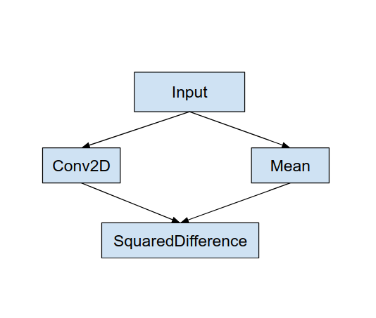

# TensorFlow Lite delegates

_Note: Delegate API is still experimental and is subject to change._


## What is a TensorFlow Lite delegate?

A TensorFlow Lite delegate is a way to delegate part or all of graph execution to another executor.


## Why should I use delegates?

Running inference on compute-heavy machine learning models on mobile devices is resource demanding due to the devices' limited processing and power.

Instead of relying on the CPU, some devices have hardware accelerators, such as GPU or DSP, that allows for better performance and higher energy efficiency.

## Using the GPU delegate

TensorFlow Lite provides a GPU delegate that can be used to accelerate models on
devices that have a GPU available.

For an overview of the GPU delegate, see
[TensorFlow Lite on GPU](https://www.tensorflow.org/lite/performance/gpu_advanced).
For step-by-step tutorials on using the GPU delegate with Android and iOS, see
[TensorFlow Lite GPU Delegate Tutorial](https://www.tensorflow.org/lite/performance/gpu).

## How do delegates work?

Let's say we have a simple model graph such as the following:



If a delegate was provided for specific operations, then TensorFlow Lite will split the graph into multiple subgraphs where each subgraph will be handled by a delegate.

Let's assume that there is a delegate "MyDelegate," which has a faster implementation for Conv2D and Mean operations. The resulting main graph will be updated to look like below.


Each subgraph that is handled by a delegate will be replaced with a node that evaluates the subgraph on its invoked call.

Depending on the model, the final graph can end up with one node, which means that all of the graphs were delegated or multiple nodes handled the subgraphs. In general, you don't want to have multiple subgraphs handled by the delegate, since each time you switch from delegate to the main graph, there is an overhead for passing the results from the subgraph to the main graph. It's not always safe to share memory.


## How to add a delegate

_Note that the API used below is experimental and is subject to change._

Based on the previous section, to add a delegate, we need to do the following:


1.  Define a kernel node that is responsible for evaluating the delegate subgraph
1.  Create an instance of [TfLiteDelegate](https://github.com/tensorflow/tensorflow/blob/master/tensorflow/lite/c/c_api_internal.h#L607), which is responsible for registering the kernel node and claiming the nodes that the delegate can execute

To see it in code, let's define a delegate and call it "MyDelegate," which can execute Conv2D and Mean operations faster.

```
// This is where the execution of the operations or whole graph happens.
// The class below has an empty implementation just as a guideline
// on the structure.
class MyDelegate {
 public:
  // Returns true if my delegate can handle this type of op.
  static bool SupportedOp(const TfLiteRegistration* registration) {
    switch (registration->builtin_code) {
      case kTfLiteBuiltinConv2d:
      case kTfLiteBuiltinMean:
        return true;
      default:
        return false;
    }
  }

  // Any initialization code needed
  bool Init() {}
  // Any preparation work needed (e.g. allocate buffers)
  bool Prepare(TfLiteContext* context, TfLiteNode* node) {}
  // Actual running of the delegate subgraph.
  bool Invoke(TfLiteContext* context, TfLiteNode* node) {}
  // ... Add any other methods needed.
};

// Create the TfLiteRegistration for the Kernel node which will replace
// the subgraph in the main TfLite graph.
TfLiteRegistration GetMyDelegateNodeRegistration() {
  // This is the registration for the Delegate Node that gets added to
  // the TFLite graph instead of the subGraph it replaces.
  // It is treated as a an OP node. But in our case
  // Init will initialize the delegate
  // Invoke will run the delegate graph.
  // Prepare for preparing the delegate.
  // Free for any cleaning needed by the delegate.
  TfLiteRegistration kernel_registration;
  kernel_registration.builtin_code = kTfLiteBuiltinDelegate;
  kernel_registration.custom_name = "MyDelegate";
  kernel_registration.free = [](TfLiteContext* context, void* buffer) -> void {
    delete reinterpret_cast<MyDelegate*>(buffer);
  };
  kernel_registration.init = [](TfLiteContext* context, const char* buffer,
                                   size_t) -> void* {
    // In the node init phase, initialize MyDelegate instance
    const TfLiteDelegateParams* delegate_params =
        reinterpret_cast<const TfLiteDelegateParams*>(buffer);
    MyDelegate* my_delegate = new MyDelegate;
    if (!my_delegate->Init(context, params)) {
      return nullptr;
    }
    return my_delegate;
  };
  kernel_registration.invoke = [](TfLiteContext* context,
                                   TfLiteNode* node) -> TfLiteStatus {
    MyDelegate* kernel = reinterpret_cast<MyDelegate*>(node->user_data);
    return kernel->Invoke(context, node);
  };
  kernel_registration.prepare = [](TfLiteContext* context,
                                    TfLiteNode* node) -> TfLiteStatus {
    MyDelegate* kernel = reinterpret_cast<MyDelegate*>(node->user_data);
    return kernel->Prepare(context, node);
  };

  return kernel_registration;
}

// TfLiteDelegate methods

TfLiteStatus DelegatePrepare(TfLiteContext* context, TfLiteDelegate* delegate) {
  // Claim all nodes that can be evaluated by the delegate and ask the
  // framework to update the graph with delegate kernel instead.
  // Reserve 1 element, since we need first element to be size.
  std::vector<int> supported_nodes(1);
  TfLiteIntArray* plan;
  TF_LITE_ENSURE_STATUS(context->GetExecutionPlan(context, &plan));
  TfLiteNode* node;
  TfLiteRegistration* registration;
  for (int node_index : TfLiteIntArrayView(plan)) {
    TF_LITE_ENSURE_STATUS(context->GetNodeAndRegistration(
        context, node_index, &node, &registration));
    if (MyDelegate::SupportedOp(registration)) {
      supported_nodes.push_back(node_index);
    }
  }
  // Set first element to the number of nodes to replace.
  supported_nodes[0] = supported_nodes.size() - 1;
  TfLiteRegistration my_delegate_kernel_registration =
      GetMyDelegateNodeRegistration();

  // This call split the graphs into subgraphs, for subgraphs that can be
  // handled by the delegate, it will replace it with a
  // 'my_delegate_kernel_registration'
  return context->ReplaceNodeSubsetsWithDelegateKernels(
      context, my_delegate_kernel_registration,
      reinterpret_cast<TfLiteIntArray*>(supported_nodes.data()), delegate);
}

void FreeBufferHandle(TfLiteContext* context, TfLiteDelegate* delegate,
                      TfLiteBufferHandle* handle) {
  // Do any cleanups.
}

TfLiteStatus CopyToBufferHandle(TfLiteContext* context,
                                TfLiteDelegate* delegate,
                                TfLiteBufferHandle buffer_handle,
                                TfLiteTensor* tensor) {
  // Copies data from tensor to delegate buffer if needed.
  return kTfLiteOk;
}

TfLiteStatus CopyFromBufferHandle(TfLiteContext* context,
                                  TfLiteDelegate* delegate,
                                  TfLiteBufferHandle buffer_handle,
                                  TfLiteTensor* tensor) {
  // Copies the data from delegate buffer into the tensor raw memory.
  return kTfLiteOk;
}

// Caller takes ownership of the returned pointer.
TfLiteDelegate* CreateMyDelegate() {
  TfLiteDelegate* delegate = new TfLiteDelegate;

  delegate->data_ = nullptr;
  delegate->flags = kTfLiteDelegateFlagsNone;
  delegate->Prepare = &DelegatePrepare;
  // This cannot be null.
  delegate->CopyFromBufferHandle = &CopyFromBufferHandle;
  // This can be null.
  delegate->CopyToBufferHandle = &CopyToBufferHandle;
  // This can be null.
  delegate->FreeBufferHandle = &FreeBufferHandle;

  return delegate;
}


// To add the delegate you need to call

auto* my_delegate = CreateMyDelegate();
if (interpreter->ModifyGraphWithDelegate(my_delegate) !=
        kTfLiteOk) {
  // Handle error
} else {
  interpreter->Invoke();
}
...
// Don't forget to delete your delegate
delete my_delegate;


```
