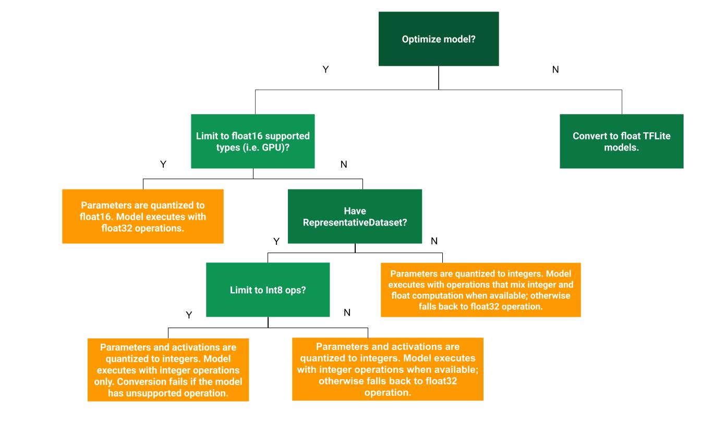

# Post-training quantization

Post-training quantization includes general techniques to reduce model size
while also improving CPU and hardware accelerator latency with little
degradation in model accuracy. These techniques can be performed on an
already-trained float TensorFlow model and applied during TensorFlow Lite
conversion.

### Optimization options



### Quantizing weights

The simplest form of post-training quantization quantizes weights from floating
point to 8-bits of precision. This technique is enabled as an option in the
[TensorFlow Lite converter](../convert/):

```
import tensorflow as tf
converter = tf.lite.TFLiteConverter.from_saved_model(saved_model_dir)
converter.optimizations = [tf.lite.Optimize.OPTIMIZE_FOR_SIZE]
tflite_quant_model = converter.convert()
```

At inference, weights are converted from 8-bits of precision to floating point and
computed using floating-point kernels. This conversion is done once and cached to reduce latency.

To further improve latency, hybrid operators dynamically quantize activations to 8-bits and
perform computations with 8-bit weights and activations. This optimization provides latencies
close to fully fixed-point inference. However, the outputs are still stored using
floating point, so that the speedup with hybrid ops is less than a full fixed-point computation.
Hybrid ops are available for the most compute-intensive operators in a network:

*  [tf.contrib.layers.fully_connected](https://www.tensorflow.org/api_docs/python/tf/contrib/layers/fully_connected)
*  [tf.nn.conv2d](https://www.tensorflow.org/api_docs/python/tf/nn/conv2d)
*  [tf.nn.embedding_lookup](https://www.tensorflow.org/api_docs/python/tf/nn/embedding_lookup)
*  [BasicRNN](https://www.tensorflow.org/api_docs/python/tf/contrib/rnn/BasicRNNCell)
*  [tf.nn.bidirectional_dynamic_rnn for BasicRNNCell type](https://www.tensorflow.org/api_docs/python/tf/nn/bidirectional_dynamic_rnn)
*  [tf.nn.dynamic_rnn for LSTM and BasicRNN Cell types](https://www.tensorflow.org/api_docs/python/tf/nn/dynamic_rnn)

### Full integer quantization of weights and activations

We can get further latency improvements, reductions in peak memory usage, and
access to integer only hardware accelerators by making sure all model math is
quantized. To do this, we need to measure the dynamic range of activations and
inputs with a representative data set. You can simply create an input data
generator and provide it to our converter.

```
import tensorflow as tf

def representative_dataset_gen():
  for _ in range(num_calibration_steps):
    # Get sample input data as a numpy array in a method of your choosing.
    yield [input]

converter = tf.lite.TFLiteConverter.from_saved_model(saved_model_dir)
converter.optimizations = [tf.lite.Optimize.DEFAULT]
converter.representative_dataset = representative_dataset_gen
tflite_quant_model = converter.convert()
```

The resulting model will be fully quantized but still take float input and
output for convenience.

Ops that do not have quantized implementations will automatically be left in
floating point. This allows conversion to occur smoothly but may restrict
deployment to accelerators that support float. To require the converter to only
output integer operations, one can specify:

```
converter.target_spec.supported_ops = [tf.lite.OpsSet.TFLITE_BUILTINS_INT8]
```

Note: `target_spec.supported_ops` was previously `target_ops` in the Python API.

This makes the converter throw an error if it encounters an operation it cannot
currently quantize.

### Model accuracy

Since weights are quantized post training, there could be an accuracy loss,
particularly for smaller networks. Pre-trained fully quantized models are
provided for specific networks in the
[TensorFlow Lite model repository](../models/). It is important to check the
accuracy of the quantized model to verify that any degradation in accuracy is
within acceptable limits. There is a tool to evaluate
[TensorFlow Lite model accuracy](https://github.com/tensorflow/tensorflow/blob/master/tensorflow/lite/tools/accuracy/README.md){:.external}.

If the accuracy drop is too high, consider using
[quantization aware training](https://github.com/tensorflow/tensorflow/tree/r1.13/tensorflow/contrib/quantize){:.external}.

### Representation for quantized tensors

8-bit quantization approximates floating point values using the following
formula. `real_value = (int8_value - zero_point) * scale`.

The representation has two main parts:

*   Per-axis (aka per-channel) or per-tensor weights represented by int8 two’s
    complement values in the range [-127, 127] with zero-point equal to 0.

*   Per-tensor activations/inputs represented by int8 two’s complement values in
    the range [-128, 127], with a zero-point in range [-128, 127].

For a detailed view of our quantization scheme, please see our
[quantization spec](./quantization_spec.md). Hardware vendors who want to plug
into TensorFlow Lite's delegate interface are encouraged to implement the
quantization scheme described there.
